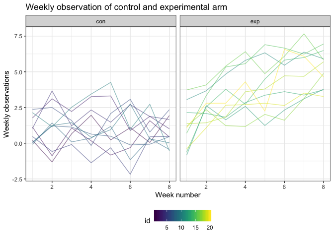
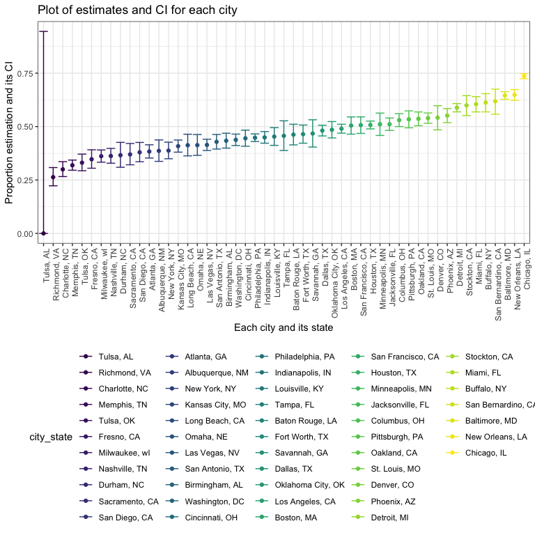

HW5
================
Sijia Yue

Problem 1
---------

### Data cleaning

Create a dataframe that contains subject ID, arm and observations.

``` r
# save file paths into string
file_name = list.files(path = "data")
file_base = "./data/"
file_path = str_c(file_base, file_name)

output = vector("list", length = 20)

# use map function to load files in iterations
output = 
  map(file_path, read.csv) 

# save file into dataframe and data cleaning
arm_data = 
  bind_rows(output) %>% 
  as.tibble() %>% 
  mutate(id = as.integer(row_number())) %>% 
  mutate(name = file_name) %>% 
  separate(name, into = c("arm","subject_id"), sep = "_") %>% 
  mutate(subject_id = as.numeric(str_replace(subject_id, ".csv",""))) %>% 
  gather(key = week, value = observation, week_1:week_8) %>% 
  mutate(week = as.numeric(str_replace(week, "week_",""))) %>% 
  mutate(arm = as.factor(arm))
```

### Plot

Make the spaghetti plot

``` r
arm_data %>% 
  ggplot(aes(x = week, y = observation, group = id)) +
  geom_line(aes(color = id), alpha = .5) +
  facet_grid(.~arm) +
  labs(
    title = "Weekly observation of control and experimental arm",
    x = "Week number",
    y = "Weekly observations"
  ) +
  theme_bw() +
  theme(legend.position = "bottom") +
  viridis::scale_color_viridis(discrete = FALSE)
```

 There is an obvious difference between the control arm and the experimental arm. In control arm group, the weekly observation stays static. In contrast, the weekly observations continues increasing as the week number grows in experimental arm group.

Problem 2
---------

``` r
# read data and data cleaning
file = read_csv("file/homicide-data.csv") %>% 
  janitor::clean_names() 
```

    ## Parsed with column specification:
    ## cols(
    ##   uid = col_character(),
    ##   reported_date = col_integer(),
    ##   victim_last = col_character(),
    ##   victim_first = col_character(),
    ##   victim_race = col_character(),
    ##   victim_age = col_character(),
    ##   victim_sex = col_character(),
    ##   city = col_character(),
    ##   state = col_character(),
    ##   lat = col_double(),
    ##   lon = col_double(),
    ##   disposition = col_character()
    ## )

``` r
# Describe the raw data
homicide_data = 
  file %>% 
  mutate(city_state = str_c(city, ", " , state)) %>% 
  group_by(city_state) %>% 
  summarize(solved = sum(disposition == "Closed by arrest"), 
            unsolved = sum(disposition == "Closed without arrest" | disposition == "Open/No arrest"),
            total = sum(solved + unsolved)) 
```

``` r
baltimore = 
homicide_data %>% 
  filter(city_state == "Baltimore, MD")

baltimore.prop = 
  prop.test(baltimore$unsolved, baltimore$total) %>% 
  broom::tidy() %>% 
  select(estimate, conf.low, conf.high)
```

Write the function

``` r
prop_test = function(cities){
  city_name = 
    homicide_data %>% 
    filter(city_state == cities) 
  
  prop.test(city_name$unsolved, city_name$total)  %>% 
    broom::tidy() %>% 
    select(estimate, conf.low, conf.high)
}
# Check the function
prop_test("Buffalo, NY")
```

    ## # A tibble: 1 x 3
    ##   estimate conf.low conf.high
    ##      <dbl>    <dbl>     <dbl>
    ## 1    0.612    0.569     0.654

Run the iteration

``` r
prop_data = 
  map(homicide_data$city_state, prop_test) %>% 
  bind_rows() %>% 
  mutate(id = as.integer(row_number()))
```

    ## Warning in prop.test(city_name$unsolved, city_name$total): Chi-squared
    ## approximation may be incorrect

``` r
homicide_data = 
  homicide_data %>% 
  mutate(id = as.integer(row_number()))

prop_results = left_join(prop_data, homicide_data, by = "id") %>% 
  select(city_state, estimate, conf.low, conf.high)
```

Plot the CI

``` r
prop_results %>% 
  mutate(city_state = fct_reorder(city_state, estimate)) %>% 
  ggplot(aes(x = city_state, y = estimate, ymin = conf.low, ymax = conf.high, color = city_state)) +
  geom_point() +
  geom_errorbar() +
  labs(
    title = "Plot of estimates and CI for each city",
    x = "Each city and its state",
    y = "Proportion estimation and its CI"
  ) +
  theme_bw() +
  theme(legend.position = "bottom",
        axis.text.x = element_text(angle = 90, hjust = 1)) +
  viridis::scale_color_viridis(discrete = TRUE)
```


