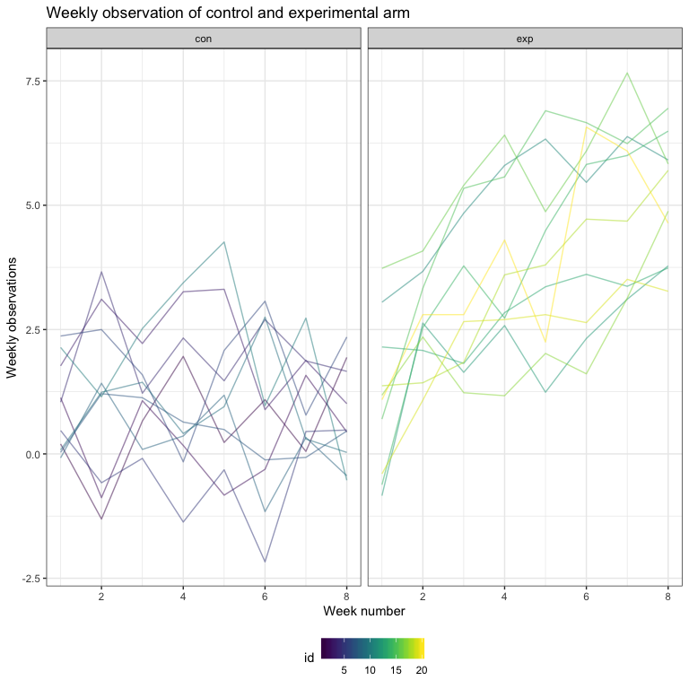

HW5
================
Sijia Yue

Problem 1
---------

### Data cleaning

Create a dataframe that contains subject ID, arm and observations.

``` r
# save file paths into string
file_name = list.files(path = "data")
file_base = "./data/"
file_path = str_c(file_base, file_name)

output = vector("list", length = 20)

# use map function to load files in iterations
output = 
  map(file_path, read.csv) 

# save file into dataframe and data cleaning
arm_data = 
  bind_rows(output) %>% 
  as.tibble() %>% 
  mutate(id = as.integer(row_number())) %>% 
  mutate(name = file_name) %>% 
  separate(name, into = c("arm","subject_id"), sep = "_") %>% 
  mutate(subject_id = as.numeric(str_replace(subject_id, ".csv",""))) %>% 
  gather(key = week, value = observation, week_1:week_8) %>% 
  mutate(week = as.numeric(str_replace(week, "week_",""))) %>% 
  mutate(arm = as.factor(arm))
```

### Plot

Make the spaghetti plot

``` r
arm_data %>% 
  ggplot(aes(x = week, y = observation, group = id)) +
  geom_line(aes(color = id), alpha = .5) +
  facet_grid(.~arm) +
  labs(
    title = "Weekly observation of control and experimental arm",
    x = "Week number",
    y = "Weekly observations"
  ) +
  theme_bw() +
  theme(legend.position = "bottom") +
  viridis::scale_color_viridis(discrete = FALSE)
```



There is an obvious difference between the control arm and the experimental arm. In control arm group, the weekly observation stays static. In contrast, the weekly observations continues increasing as the week number grows in experimental arm group.

Problem 2
---------

### Read file and data cleaning

``` r
# read data into R
file = read_csv("file/homicide-data.csv") %>% 
  janitor::clean_names() 
```

    ## Parsed with column specification:
    ## cols(
    ##   uid = col_character(),
    ##   reported_date = col_integer(),
    ##   victim_last = col_character(),
    ##   victim_first = col_character(),
    ##   victim_race = col_character(),
    ##   victim_age = col_character(),
    ##   victim_sex = col_character(),
    ##   city = col_character(),
    ##   state = col_character(),
    ##   lat = col_double(),
    ##   lon = col_double(),
    ##   disposition = col_character()
    ## )

The dataset contains 52179 homicides in 28 different states from 2007 to 2017. It has 12 variables, which indicates the date, victim name, race, age, sex and location.

``` r
# Data cleaning 
homicide_data = 
  file %>% 
  # Add new variable
  mutate(city_state = str_c(city, ", " , state)) %>% 
  group_by(city_state) %>% 
  # Define the status of cases
  summarize(solved = sum(disposition == "Closed by arrest"), 
            unsolved = sum(disposition == "Closed without arrest" | disposition == "Open/No arrest"),
            total = sum(solved + unsolved))  

# a brief look of the tidy data  
homicide_data %>% 
  knitr::kable()
```

| city\_state        |  solved|  unsolved|  total|
|:-------------------|-------:|---------:|------:|
| Albuquerque, NM    |     232|       146|    378|
| Atlanta, GA        |     600|       373|    973|
| Baltimore, MD      |    1002|      1825|   2827|
| Baton Rouge, LA    |     228|       196|    424|
| Birmingham, AL     |     453|       347|    800|
| Boston, MA         |     304|       310|    614|
| Buffalo, NY        |     202|       319|    521|
| Charlotte, NC      |     481|       206|    687|
| Chicago, IL        |    1462|      4073|   5535|
| Cincinnati, OH     |     385|       309|    694|
| Columbus, OH       |     509|       575|   1084|
| Dallas, TX         |     813|       754|   1567|
| Denver, CO         |     143|       169|    312|
| Detroit, MI        |    1037|      1482|   2519|
| Durham, NC         |     175|       101|    276|
| Fort Worth, TX     |     294|       255|    549|
| Fresno, CA         |     318|       169|    487|
| Houston, TX        |    1449|      1493|   2942|
| Indianapolis, IN   |     728|       594|   1322|
| Jacksonville, FL   |     571|       597|   1168|
| Kansas City, MO    |     704|       486|   1190|
| Las Vegas, NV      |     809|       572|   1381|
| Long Beach, CA     |     222|       156|    378|
| Los Angeles, CA    |    1151|      1106|   2257|
| Louisville, KY     |     315|       261|    576|
| Memphis, TN        |    1031|       483|   1514|
| Miami, FL          |     294|       450|    744|
| Milwaukee, wI      |     712|       403|   1115|
| Minneapolis, MN    |     179|       187|    366|
| Nashville, TN      |     489|       278|    767|
| New Orleans, LA    |     504|       930|   1434|
| New York, NY       |     384|       243|    627|
| Oakland, CA        |     439|       508|    947|
| Oklahoma City, OK  |     346|       326|    672|
| Omaha, NE          |     240|       169|    409|
| Philadelphia, PA   |    1677|      1360|   3037|
| Phoenix, AZ        |     410|       504|    914|
| Pittsburgh, PA     |     294|       337|    631|
| Richmond, VA       |     316|       113|    429|
| Sacramento, CA     |     237|       139|    376|
| San Antonio, TX    |     476|       357|    833|
| San Bernardino, CA |     105|       170|    275|
| San Diego, CA      |     286|       175|    461|
| San Francisco, CA  |     327|       336|    663|
| Savannah, GA       |     131|       115|    246|
| St. Louis, MO      |     772|       905|   1677|
| Stockton, CA       |     178|       266|    444|
| Tampa, FL          |     113|        95|    208|
| Tulsa, AL          |       1|         0|      1|
| Tulsa, OK          |     390|       193|    583|
| Washington, DC     |     756|       589|   1345|

For city `Tulsa` in state `AL`, there only have one solved case and no unsolved case. So, I guess this should be a typo which I would filter in away from the dataset.

``` r
homicide_data =
  homicide_data %>% 
  filter(city_state != "Tulsa, AL")
```

### Proportion tests

First, I will use `prop.test()` function to implement a proportion test for Baltimore to estimate the proportion of unsolved cases.

``` r
baltimore = 
homicide_data %>% 
  filter(city_state == "Baltimore, MD")

# Put Baltimore into the function
prop.test(baltimore$unsolved, baltimore$total) %>% 
  broom::tidy() %>% 
  select(estimate, conf.low, conf.high) %>% 
  knitr::kable(digits = 3)
```

|  estimate|  conf.low|  conf.high|
|---------:|---------:|----------:|
|     0.646|     0.628|      0.663|

So, the estimation of proportion for unsolved homicide cases is 0.646 with a CI of (0.628, 0.663).

Then, I wrote the function of implementing `prop.test()` for different cities to calculate the estimated proportion of unsolved cases and CI.

``` r
# Write the function
prop_test = function(cities){
  city_name = 
    homicide_data %>% 
    filter(city_state == cities) 
  
  prop.test(city_name$unsolved, city_name$total)  %>% 
    broom::tidy() %>% 
    select(estimate, conf.low, conf.high)
}

# Check the function
prop_test("Buffalo, NY")
```

    ## # A tibble: 1 x 3
    ##   estimate conf.low conf.high
    ##      <dbl>    <dbl>     <dbl>
    ## 1    0.612    0.569     0.654

Next, use `map()` function to run the iteration of all cities.

``` r
prop_data = 
  # nest the data for the case status
  nest(homicide_data, solved:total) %>% 
  # Using the map function to do the iteration
  mutate(prop_test = map(homicide_data$city_state, prop_test)) %>% 
  select(city_state, prop_test) %>% 
  unnest() %>% 
  select(city_state, estimate, conf.low, conf.high)
```

Finally, using the results from mapping, I plot the CI of the unsolved cases proportion estimation for different cities.

``` r
prop_data %>% 
  mutate(city_state = fct_reorder(city_state, estimate)) %>% 
  ggplot(aes(x = city_state, y = estimate, ymin = conf.low, ymax = conf.high, color = city_state)) +
  geom_point() +
  geom_errorbar() +
  labs(
    title = "Plot of estimates and CI for each city",
    x = "Each city and its state",
    y = "Proportion estimation and its CI"
  ) +
  theme_bw() +
  theme(legend.position = "bottom",
        axis.text.x = element_text(angle = 90, hjust = 1)) +
  viridis::scale_color_viridis(discrete = TRUE)
```


